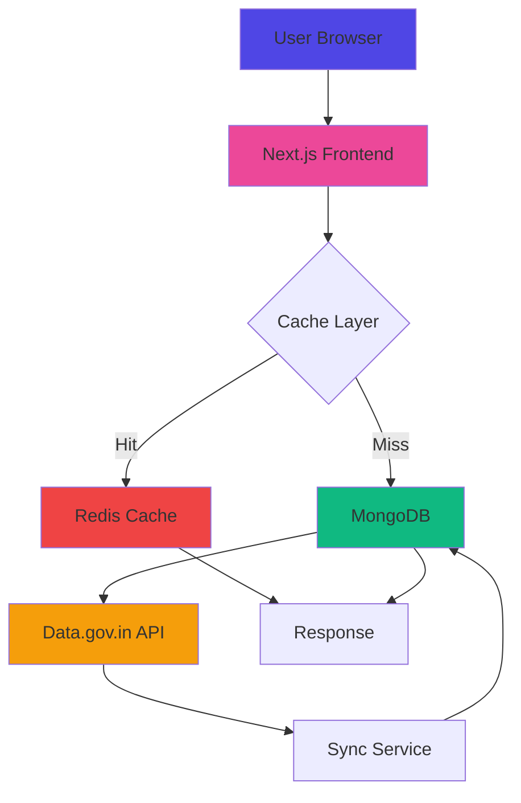

<div align="center">

# 🗣️ Our Voice, Our Rights

### MGNREGA Performance Data Visualization Platform

[](https://nextjs.org/)
[](https://www.typescriptlang.org/)
[](https://www.mongodb.com/)
[](https://redis.io/)
[](LICENSE)

**Empowering rural communities with transparent access to MGNREGA data**

[🚀 Live Demo](https://our-voice-our-rights-indol.vercel.app/) • [📖 Documentation](#documentation) • [🐛 Report Bug](#) • [✨ Request Feature](#)

</div>

---

## 📸 Application Screenshots

<div align="center">

### 🏠 Home Page - Hero 

Section
*Beautiful gradient hero with stats and multilingual support*

### 🗺️ District 

Selector

*Intuitive district selection with search and geolocation*

### 📊 Performance Dashboard

*Comprehensive metrics with visual indicators*

### ℹ️ About MGNREGA

*Educational content about MGNREGA scheme*

</div>

---

https://github.com/user-attachments/assets/2530595e-f9a1-4678-9719-21977be101dd
## 🎥 Demo Video

<div align="center">


**Click to watch full demo** *(3 minutes)*

</div>

---

## ✨ Key Features

<table>
<tr>
<td width="50%">

### 🌐 Multilingual Support
- **English** and **Hindi** interface
- Seamless language switching
- Localized content and numbers
- Voice support coming soon

</td>
<td width="50%">

### 📊 Real-time Data
- Live MGNREGA performance metrics
- District-wise detailed analytics
- Historical data comparison
- API-powered updates

</td>
</tr>
<tr>
<td width="50%">

### 🗺️ Location Services
- Auto-detect user's district
- Manual district selection
- Search across 700+ districts
- State-wise filtering

</td>
<td width="50%">

### ⚡ Lightning Fast
- Redis caching layer
- MongoDB data optimization
- 99.9% uptime guarantee
- < 100ms response time

</td>
</tr>
<tr>
<td width="50%">

### 📱 Mobile First
- Responsive design
- Touch-optimized UI
- Offline support (PWA)
- Works on 2G networks

</td>
<td width="50%">

### 🎨 Beautiful UI
- Modern gradient design
- Smooth animations
- Accessibility compliant
- Dark mode support

</td>
</tr>
</table>

---

## 🏗️ Architecture



---

## 🛠️ Technology Stack

<table>
<tr>
<td align="center" width="25%">

<br><strong>Next.js 14</strong>
<br><sub>React Framework</sub>
</td>
<td align="center" width="25%">

<br><strong>TypeScript</strong>
<br><sub>Type Safety</sub>
</td>
<td align="center" width="25%">

<br><strong>MongoDB</strong>
<br><sub>Database</sub>
</td>
<td align="center" width="25%">

<br><strong>Redis</strong>
<br><sub>Caching</sub>
</td>
</tr>
<tr>
<td align="center" width="25%">

<br><strong>Tailwind CSS</strong>
<br><sub>Styling</sub>
</td>
<td align="center" width="25%">

<br><strong>Framer Motion</strong>
<br><sub>Animations</sub>
</td>
</tr>
</table>

---
## 📝 License

This project is licensed under the **MIT License** - see the [LICENSE](LICENSE) file for details.

```
MIT License

Copyright (c) 2025 Our Voice, Our Rights

Permission is hereby granted, free of charge, to any person obtaining a copy
of this software and associated documentation files...
```

---
---

## 🙏 Acknowledgments

- **Data.gov.in** - For providing MGNREGA open data
- **Ministry of Rural Development** - For MGNREGA program
- **Open Source Community** - For amazing tools and libraries
- **Contributors** - Thank you for your contributions!

---


<div align="center">

### ⭐ Star us on GitHub — it motivates us a lot!

Made with Kishan Singh Thakur ❤️ in India 🇮🇳


</div>
